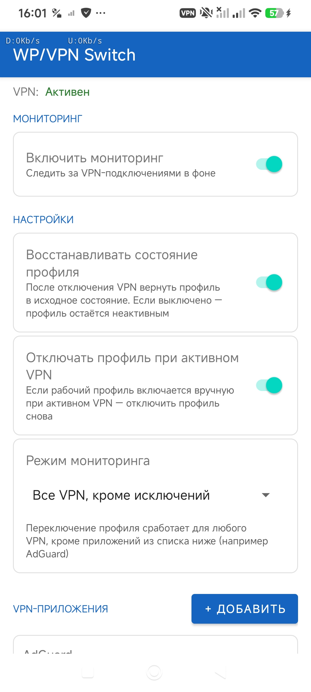
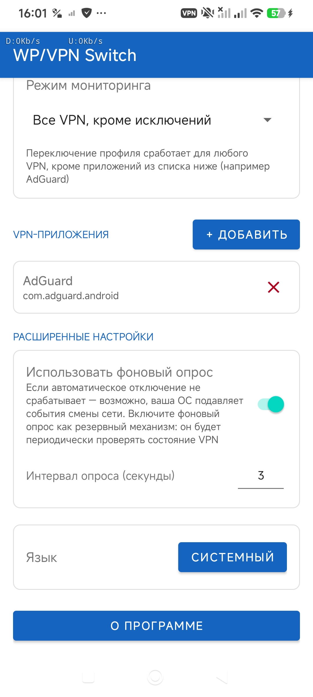
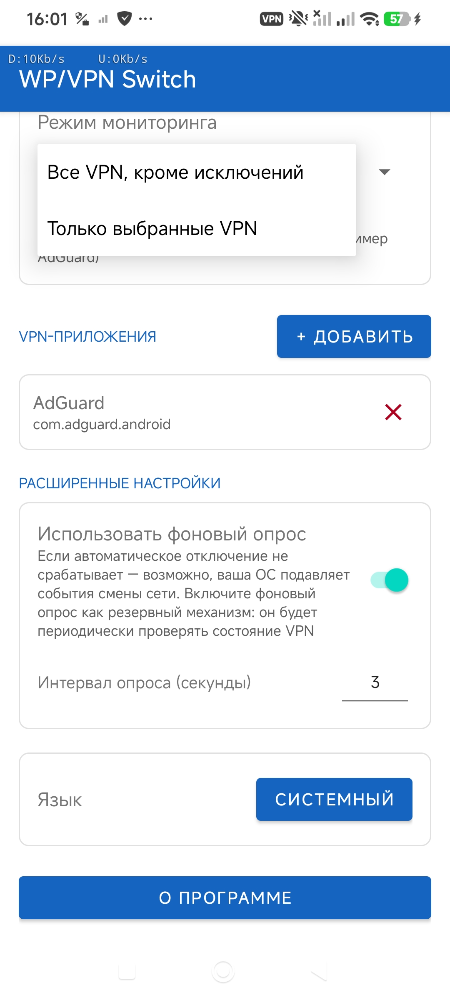
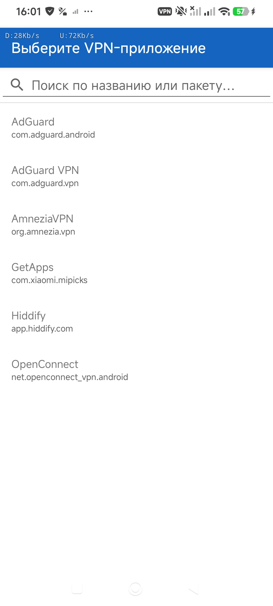
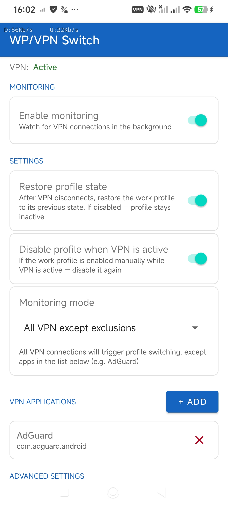
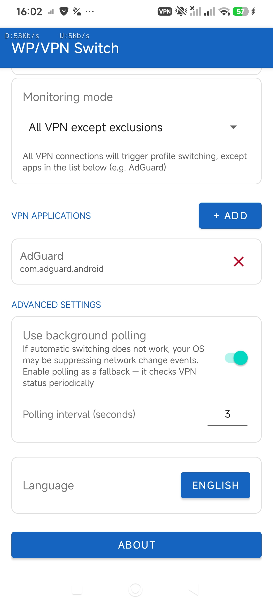
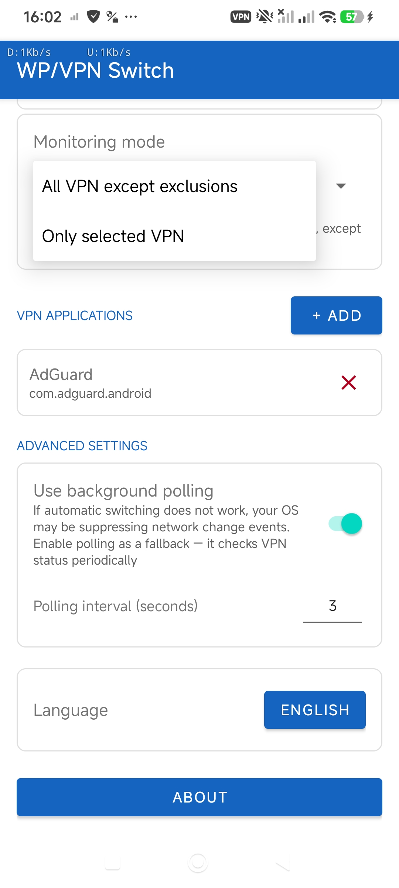
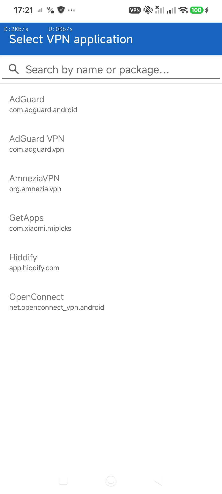

# Work Profile VPN Switcher

[](LICENSE)
[](https://android.com)

[-blue)](https://developer.android.com/about/versions/11)

Приложение для автоматического управления рабочим профилем Android при подключении VPN.

[English](#english) | [Русский](#русский)

---

## Русский

### Описание

Приложение отслеживает VPN-подключения и автоматически отключает рабочий профиль когда VPN активен, и восстанавливает его состояние после отключения VPN. Удобно для случаев когда рабочий профиль содержит приложения которые не должны работать через VPN-туннель, или наоборот — когда нужно изолировать рабочие приложения от VPN-трафика.

### Интерфейс

<table>
  <tr>
    <td></td>
    <td></td>
    <td></td>
    <td></td>
  </tr>
</table>

---

### Возможности

- **Автоматическое отключение** рабочего профиля при подключении VPN
- **Восстановление состояния** профиля после отключения VPN (опционально)
- **Обратная логика** — отключать профиль если он был включён вручную при активном VPN (опционально)
- **Режим allowlist** — мониторить только выбранные VPN-приложения
- **Режим denylist** — мониторить все VPN, кроме исключённых (в первую очередь для корректной работы совместно с AdGuard)
- **Фоновый опрос** — резервный механизм для устройств, где события сети подавляются ОС
- **Мультиязычность** — русский и английский интерфейс

### Требования

- Android 11 (API 30) и выше
- Настроенный рабочий профиль (через [Shelter](https://f-droid.org/packages/net.typeblog.shelter/) или другое приложение)
- Разрешение `MODIFY_QUIET_MODE` — выдаётся вручную через ADB (см. ниже)

### Установка

1. Скачать APK из [Releases](https://github.com/snood21/workprofile-vpn-switcher/releases)
2. Установить на устройство
3. Выдать разрешение через ADB:

```bash
adb shell pm grant io.github.snood21.workprofilevpnswitcher android.permission.MODIFY_QUIET_MODE
```

> **Примечание:** разрешение нужно выдавать заново после переустановки приложения. При обычном обновлении сохраняется.

### Настройка

1. Открыть приложение
2. В разделе **VPN-приложения** добавить нужные VPN-приложения
3. Выбрать **Режим мониторинга**:
   - *Все VPN, кроме исключений* (по умолчанию) — срабатывает на любой VPN кроме добавленных в список (подходит для исключения AdGuard)
   - *Только выбранные приложения* — срабатывает только на VPN-приложения из списка
4. Включить **Мониторинг**

#### Если автоматическое отключение не срабатывает

Некоторые прошивки (в том числе MIUI/HyperOS) подавляют события смены сети для фоновых приложений. В этом случае включите **Фоновый опрос** в разделе Расширенные настройки.

Также необходимо:
- Разрешить автозапуск приложения в настройках телефона
- Установить режим батареи для приложения: **Без ограничений**

### Разрешения

| Разрешение               | Для чего                                         |
|--------------------------|--------------------------------------------------|
| `ACCESS_NETWORK_STATE`   | Отслеживание VPN-подключений                     |
| `FOREGROUND_SERVICE`     | Фоновый мониторинг                               |
| `RECEIVE_BOOT_COMPLETED` | Автозапуск после перезагрузки                    |
| `POST_NOTIFICATIONS`     | Уведомления о блокировке профиля                 |
| `VIBRATE`                | Тактильная обратная связь                        |
| `MODIFY_QUIET_MODE`      | Управление рабочим профилем (выдаётся через ADB) |

### Сборка из исходников

```bash
git clone https://github.com/snood21/workprofile-vpn-switcher.git
cd workprofile-vpn-switcher
./gradlew assembleDebug
```

После сборки выдать разрешение:
```bash
adb shell pm grant io.github.snood21.workprofilevpnswitcher.debug android.permission.MODIFY_QUIET_MODE
```

---

### Поддержать разработчика
[Boosty](https://boosty.to/snood21/donate)

[Donatty (доступна оплата по СБП)](https://donatty.com/snood21)

## Лицензия

[Apache License 2.0](LICENSE)

Copyright 2025 snood21

## English

### Description

An Android application that automatically manages the work profile when a VPN connection is active. It disables the work profile when VPN connects and optionally restores its previous state when VPN disconnects.

### Interface

<table>
  <tr>
    <td></td>
    <td></td>
    <td></td>
    <td></td>
  </tr>
</table>

---

### Features

- **Automatic disabling** of the work profile when VPN connects
- **State restoration** after VPN disconnects (optional)
- **Reverse logic** — disable profile if manually enabled while VPN is active
- **Allowlist mode** — monitor only selected VPN apps
- **Denylist mode** — monitor all VPN connections except excluded apps (e.g. AdGuard)
- **Background polling** — fallback mechanism for devices where network events are suppressed by the OS
- **Multilingual** — Russian and English interface

### Requirements

- Android 11 (API 30) or higher
- A configured work profile (via [Shelter](https://f-droid.org/packages/net.typeblog.shelter/) or similar app)
- `MODIFY_QUIET_MODE` permission — granted manually via ADB (see below)

### Installation

1. Download the APK from [Releases](https://github.com/snood21/workprofile-vpn-switcher/releases)
2. Install on device
3. Grant the required permission via ADB:

```bash
adb shell pm grant io.github.snood21.workprofilevpnswitcher android.permission.MODIFY_QUIET_MODE
```

> **Note:** the permission must be re-granted after a clean reinstall. It persists through regular updates.

### Setup

1. Open the app
2. In the **VPN Applications** section, add your VPN apps
3. Choose **Monitoring mode**:
   - *All VPN except exclusions* — triggers for any VPN except apps in the list (suitable for excluding AdGuard)
   - *Only selected apps* — triggers only for VPN apps in the list
4. Enable **Monitoring**

#### If automatic switching does not work

Some firmware (including MIUI/HyperOS) suppresses network change events for background apps. In this case, enable **Background polling** in the Advanced settings section.

You may also need to:
- Allow autostart for the app in phone settings
- Set battery mode for the app to **No restrictions**

### Permissions

| Permission               | Purpose                               |
|--------------------------|---------------------------------------|
| `ACCESS_NETWORK_STATE`   | Monitor VPN connections               |
| `FOREGROUND_SERVICE`     | Background monitoring                 |
| `RECEIVE_BOOT_COMPLETED` | Autostart after reboot                |
| `POST_NOTIFICATIONS`     | Profile block notifications           |
| `VIBRATE`                | Haptic feedback                       |
| `MODIFY_QUIET_MODE`      | Manage work profile (granted via ADB) |

### Build from source

```bash
git clone https://github.com/snood21/workprofile-vpn-switcher.git
cd workprofile-vpn-switcher
./gradlew assembleDebug
```

After building, grant the permission:
```bash
adb shell pm grant io.github.snood21.workprofilevpnswitcher.debug android.permission.MODIFY_QUIET_MODE
```

---

### Support the developer
[Boosty](https://boosty.to/snood21/donate)

[Donatty (including SBP)](https://donatty.com/snood21)

## License

[Apache License 2.0](LICENSE)

Copyright 2025 snood21
